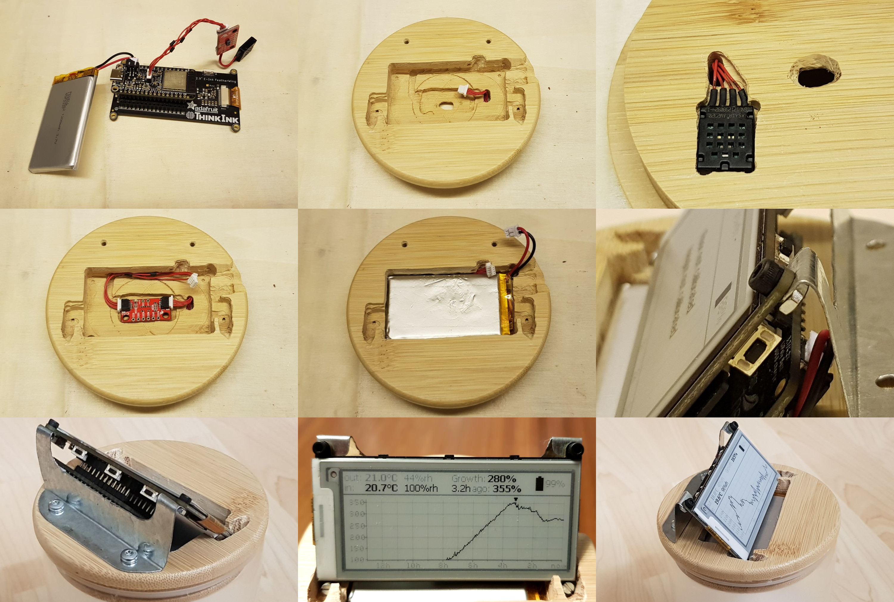
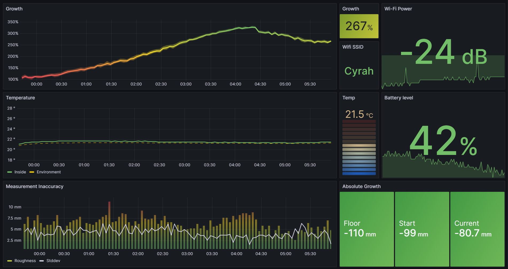
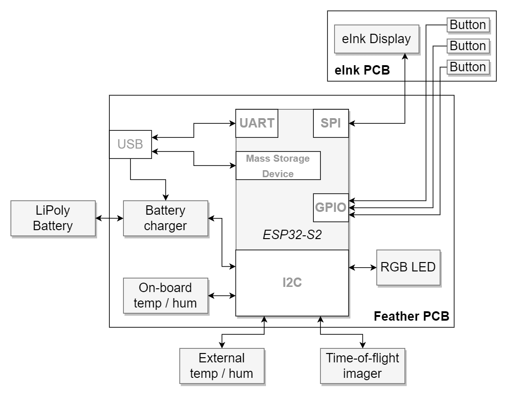
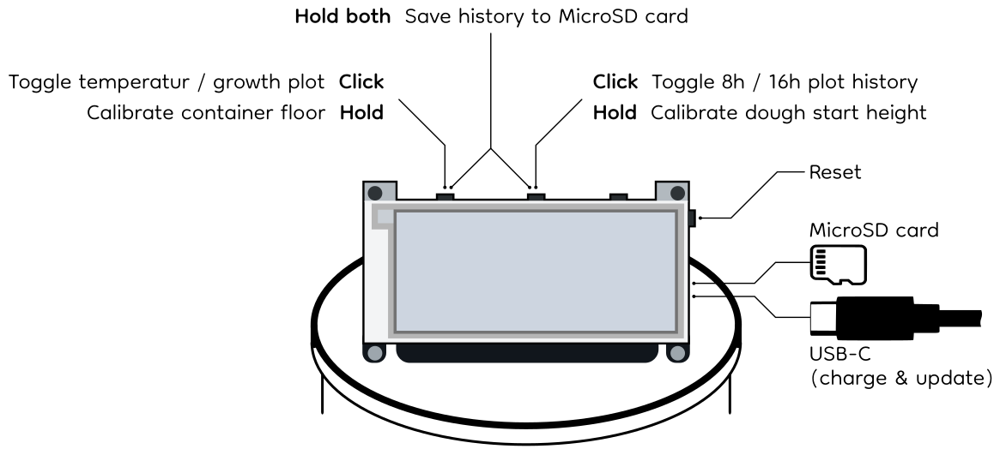
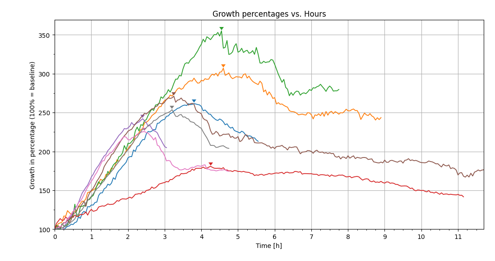

Sourdough Monitor
=================

[![CC BY-NC-SA 4.0][cc-by-nc-sa-shield]][cc-by-nc-sa]

**Sourdough monitoring system with an ESP32, a time-of-flight distance sensor and temperature/humidity sensors.**

_This work is licensed under a
[Creative Commons Attribution-NonCommercial-ShareAlike 4.0 International License][cc-by-nc-sa]._

Setup
-----

### Hardware

We use the [ESP32-S2 with BME280](https://circuitpython.org/board/adafruit_feather_esp32s2_bme280/).

Attached to it are the following devices:

- **TMF8821** TimeOfFlight distance sensor on i2c address `0x41`
  . [Link](https://shop.pimoroni.com/products/sparkfun-qwiic-mini-dtof-imager-tmf8821?variant=39880899067987)
- **ThinkInk 2.9" grayscale** e-Ink display with 296x128 pixels and four gray scales
  . [Product](https://shop.pimoroni.com/products/adafruit-2-9-grayscale-eink-epaper-display-featherwing-4-level-grayscale?variant=32283947728979)
  , [Pinouts](https://cdn-learn.adafruit.com/assets/assets/000/096/234/original/adafruit_products_FeatherWing_bb.jpg?1603386177)
  , [Button Pinout](https://cdn-learn.adafruit.com/assets/assets/000/104/602/original/eink___epaper_Pinouts_FeatherWing_Buttons.jpg?1631640413)
  , [FeatherWing Pinout](https://cdn-learn.adafruit.com/assets/assets/000/104/601/original/eink___epaper_Pinouts_2.9.jpg?1631640290)
- **BME280** on-board temperature, humidity, pressure and altitude sensor on i2c address `0x77`
  . [Manual](https://cdn.shopify.com/s/files/1/0174/1800/files/bst-bme280-ds002.pdf?v=1662743150)
  , [Product](https://shop.pimoroni.com/products/bme280-breakout?variant=29420960677971)
- **AM2320** external temperature and humidity sensor on i2c address `0x5c`
  . [Datasheet](https://akizukidenshi.com/download/ds/aosong/AM2320.pdf)
  , [Product](https://shop.pimoroni.com/products/digital-temperature-and-humidity-sensor?variant=35611648138)
- **Zio OLED** [only for debugging] 1.5" display with 128x128 pixel for debugging on i2c address `0x3c`
  . [Link](https://learn.adafruit.com/adafruit-grayscale-1-5-128x128-oled-display)
- **U132** [only for debugging] passive buzzer for signalling on a GPIO pin
  . [Schematic](https://cdn.shopify.com/s/files/1/0174/1800/products/buzzer_sch_01_1500x1500.jpg?v=1640774058)
  , [Product](https://shop.pimoroni.com/products/passive-buzzer-unit?variant=39618442297427)
- **LC709203** on-board LiPo battery monitor on i2c address `0x0b`
  . [Datasheet](https://cdn-learn.adafruit.com/assets/assets/000/094/597/original/LC709203F-D.PDF?1599248750)
  , [Product](https://learn.adafruit.com/adafruit-esp32-s2-tft-feather/i2c-on-board-sensor)

For the other on-board peripheries, the
guide [here](https://learn.adafruit.com/adafruit-esp32-s2-feather/circuitpython-essentials) provides tutorials. Also,
the schematic can be downloaded [here](https://learn.adafruit.com/assets/109937)

### Programming Language

We work with Python 3.9, specifically CircuitPython 7.3.3.

### IDE

We work with PyCharm CircuitPython, a guide to setting it up to work with circuitpythyon can be found  [here]
(https://learn.adafruit.com/welcome-to-circuitpython/pycharm-and-circuitpython).
Since CircuitPython 7.3.3 is forked from the latest MicroPython repository which
uses [Python <= 3.9 features] (https://docs.micropython.org/en/latest/genrst/index.html), we create a virtual  
environment with Python 3.9 and install the `circuitpython-stubs` as well as the
[_Serial Port Monitor_](https://plugins.jetbrains.com/plugin/8031-serial-port-monitor) plugin.

The CircuitPython libraries we use are the following (can be installed on the local `venv` as well to enhance code
completion):

- `adafruit-circuitpython-am2320` for AM2320 (temp sensor)
  . [Example](https://github.com/adafruit/Adafruit_CircuitPython_AM2320/blob/main/examples/am2320_simpletest.py)
- `adafruit-circuitpython-bme280` for BME280 (environment sensor)
  . [Example](https://github.com/adafruit/Adafruit_CircuitPython_BME280/blob/main/examples/bme280_normal_mode.py)
- `adafruit-circuitpython-lc709203f` for LC709203 (battery monitor)
  . [Example](https://github.com/adafruit/Adafruit_CircuitPython_LC709203F/blob/main/examples/lc709203f_simpletest.py)
- `adafruit-circuitpython-il0373` for IL0373 (e-Ink display)
  . [Example](https://github.com/adafruit/Adafruit_CircuitPython_IL0373/blob/main/examples/il0373_2.9_grayscale.py)
- `` for TMF8821 (ToF sensor). [Example]()
- `adafruit-circuitpython-ssd1327` for
  SSD1327. [Example](https://github.com/adafruit/Adafruit_CircuitPython_SSD1327/blob/main/examples/ssd1327_simpletest.py)
- `adafruit-circuitpython-simpleio` for PWM
- `adafruit-circuitpython-ticks` for time measurements in TMF882X driver
- `adafruit-circuitpython-typing` for datatype description in TMF882X driver
- `circuitpython-displayio-cartesian` for plotting on the display

Libraries
---------

We work with a bunch of pre-existing libraries for use of the periphery devices, most of them from [here](https://github.com/adafruit/Adafruit_CircuitPython_Bundle/releases/tag/20220904)). They are copied on the CIRCUITPYTHON volume and reside in the  [`CIRCUITPYTHON/lib`](CIRCUITPYTHON/lib) folder.

Note that there was no Python library for the TMF882X device family. Thus, we developed our own library, accessible in [`CIRCUITPYTHON/lib/tmf8821`](CIRCUITPYTHON/lib/tmf8821).

Usage
-----

The sensors and display updates happen every 4 minutes and the monitor goes to deep sleep mode between the updates. Whenever a button is pressed, the next sleep time is 1.5x the usual interval to account for interruption of an average of 0.5x the sleep time.

The battery lasts about 2-3 weeks. If the monitor is in the refrigerator (the external temperature sensor reads less than 10°C), the monitor is in power-safe mode and the sensors and display updates only happen every 9 minutes.

Holding a button means pressing it for at least 3.5 seconds, or until the blue LED on the ESP32 PCB light up. 

The recorded curves on the MicroSD card can be plotted using the scripts in [`release_tests/v1.1`](release_tests/v1.1).
Some of the growth curves look like this:

### Programming

Upon connecting an ESP32 with native USB to the computer, it's flash memory will be mounted as a thumb drive. Now the content of the folder [`CIRCUITPYTHON`](CIRCUITPYTHON) has to be copied to this thumb drive.

### Calibration of the TMF8821

For a new hardware setup, the cross talk of the TMF8821 should be calibrated to guarantee the best possible accuracy. This can be done using the script in [`experiments/distance/code4.py`](experiments/distance/code4.py) (uncomment line 44). The calibration data must then be written in byte format to a file named *"<config_spad_map>_<active_range>"* (e.g. *"3x3_normal_mode_short"*) in [`CIRCUITPYTHON/calibration`](CIRCUITPYTHON/calibration).

### Container floor preconfiguration

If there is always a container with the same height being used, it makes sense to only calibrate the floor once and write the distance in millimeters (just the number, no unit) to a file *"floor.txt"* in [`CIRCUITPYTHON/calibration`](CIRCUITPYTHON/calibration).

### Telemetry

The ESP32 tries to access the Wi-Fi and push relevant metrics to an InfluxDB bucket every time it wakes up. The following metrics are sent:
- **`height`**: Growth percentage (relative to calibrated start position)
- **`height_std`**: Standard deviation in mm of last measured distance (not relative to percentage yet)
- **`floor_calib`**: calibrated floor distance in mm
- **`start_calib`**: calibrated start distance in mm
- **`temp_in`**: Temperature in rise chamber in °C
- **`temp_out`**: Temperature in environment air in °C
- **`hum_in`**: Humidity in rise chamber
- **`hum_out`**: Humidity in environment air
- **`wifi_rssi`**: RSSI of Wi-Fi
- **`wake_reason`**: Reason for wakeup after deep-sleep: "unknown", "reset", "left" (button) or "middle" (button)
- **`battery_level`**: Battery charge percentage

#### Wi-Fi configurations

A list of Wi-Fi configurations can be stored in [`CIRCUITPYTHON/metric_telemetry/secrets.py`](CIRCUITPYTHON/metric_telemetry/secrets.py) as a tuple of `(SSID, Password)`. The Wi-Fi configurations are tried in the given order and the first working one is tried first the next time the ESP32 wakes up (the according access point channel is also cached to persistent memory and tried first next time).

Note that the CircuitPython 7.3.3 `requests` module throws a Runtime error during the SSL handshake for some pages (see the [issue here](https://github.com/adafruit/circuitpython/issues/7429)), so the complete CA chain of the POST request target URL must be downloaded:
1. Find out the cluster URL of the targets InfluxDB cloud instance (see below)
2. Download all certificates in the CA chain using [this bash command](https://unix.stackexchange.com/questions/368123/how-to-extract-the-root-ca-and-subordinate-ca-from-a-certificate-chain-in-linux/487546#487546) using the above URL
3. Open all the certificates and concatenate them in one file
4. Place the file in [`CIRCUITPYTHON/metric_telemetry/all_certs.pem`](CIRCUITPYTHON/metric_telemetry/all_certs.pem).

#### InfluxDB settings

In the same file as the Wi-Fi configurations, [`CIRCUITPYTHON/metric_telemetry/secrets.py`](CIRCUITPYTHON/metric_telemetry/secrets.py), the information about the InfluxDB are stored. To this end, create a new bucket on InfluxDB Cloud and fill in following values in the secrets file:

- `INFLUXDB_URL_WRITE`: Using as prefix the _Cluster URL (Host Name)_ from the _Organization Settings_
- `INFLUXDB_ORG`: The Organization's name
- `INFLUXDB_BUCKET`: The Bucket's name
- `INFLUXDB_API_TOKEN`: A token with write access to the bucket

A template file can be found at [`CIRCUITPYTHON/metric_telemetry/secrets_template.py`](CIRCUITPYTHON/metric_telemetry/secrets_template.py).

Then also adjust the measurement's name (`INFLUXDB_MEASUREMENT`) and the device's name (`DEVICE_NAME`) in [`CIRCUITPYTHON/code.py`](CIRCUITPYTHON/code.py).

Note that the free InfluxDB Cloud tier is enough to get started, the only relevant limitation is a data retention period of maximum 30 days.

#### Visualization in Grafana

The metrics can be visualized by e.g. [Grafana](https://grafana.com/products/cloud/metrics/). An example dashboard is visualized above and the according JSON model can be found in [`telemetry/grafana_dashboard_model.json`](telemetry/grafana_dashboard_model.json) using a free Grafana cloud setup.

### Trouble Shooting

If an exception occurred, the CircuitPython OS will flash the red LED on the ESP32 PCB 2x every 5 second.
In this case, the error message and traceback has been stored to the SD card in a file called _"exception_traceback.txt"_.
Moreover, if the USB-C cable is connected, debug messages are printed over the virtual serial port.

Hardware Limitations
--------------------

We don't want to use Button C on the eInk display since pulling it high would result in a constant current through the
onboard LED.

Similar Projects
----------------

 - https://grafana.com/blog/2020/06/17/how-to-monitor-a-sourdough-starter-with-grafana/
 - https://www.theverge.com/2021/3/19/22340817/breadwinner-smart-sourdough-starter-tracking-wifi-gadget-bread-yeast
 - https://www.justinmklam.com/posts/2021/02/levain-monitor/
 - https://www.twilio.com/blog/how-to-data-tracker-sourdough-starter?utm_campaign=sourdio-site&utm_medium=site&utm_source=sourdio
 - https://github.com/Fsned/sourSmart
 - https://hi-hi-hi.com/food/projects/2021/06/18/jar.html

[![CC BY-NC-SA 4.0][cc-by-nc-sa-image]][cc-by-nc-sa]

[cc-by-nc-sa]: http://creativecommons.org/licenses/by-nc-sa/4.0/
[cc-by-nc-sa-image]: https://licensebuttons.net/l/by-nc-sa/4.0/88x31.png
[cc-by-nc-sa-shield]: https://img.shields.io/badge/License-CC%20BY--NC--SA%204.0-lightgrey.svg
